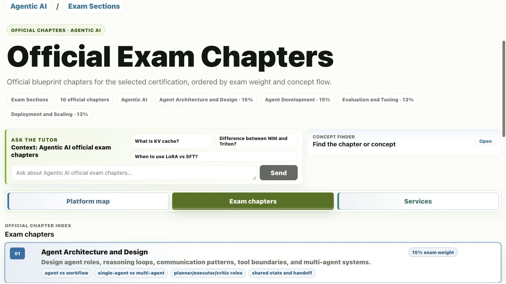
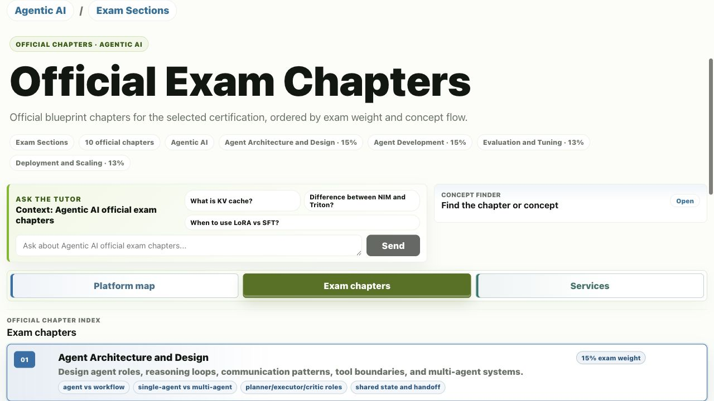
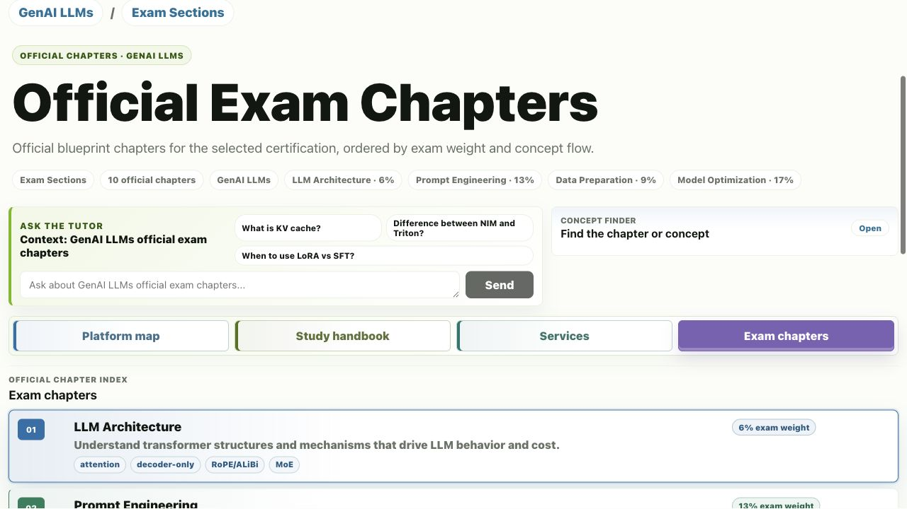
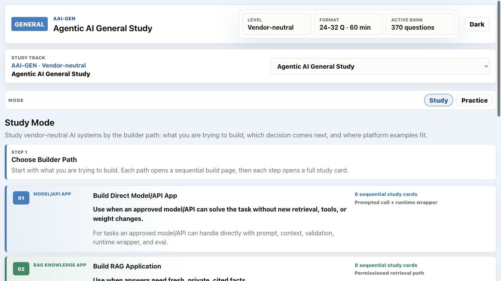

# NVIDIA Certification Practice Lab

Local study, practice, and mock-test app for NVIDIA-style AI certification prep.

This is not an NVIDIA product and it does not contain real exam content. It is a local learning tool built from public blueprint structure, original study notes, scenario-style practice questions, and generated review material.

## Scope Note

This project is deep study material for the **Generative AI / Agentic AI lane**:

- Agentic AI General Study
- NVIDIA Certified Professional - Agentic AI (NCP-AAI)
- NVIDIA Certified Professional - Generative AI LLMs (NCP-GENL)

It is not yet a full book for every NVIDIA certification in the 2026 portfolio. Infrastructure, AI operations, AI networking, accelerated data science, associate multimodal, and OpenUSD certifications would need their own blueprints, chapters, service maps, and mock banks.

## What It Does

- Provides full-width study pages for:
  - Agentic AI General Study
  - NVIDIA Certified Professional - Agentic AI
  - NVIDIA Certified Professional - Generative AI LLMs
- Turns study content into readable single-page chapters, builder paths, and focused study cards.
- Keeps NVIDIA service pages separate from general concepts so product boundaries are easier to learn.
- Runs practice drills, guided weak-domain review, and timed mock tests from local question banks.
- Supports optional tutor chat and question generation when an LLM API key is configured.

## Screenshots

### Agentic AI Exam Chapters



The Agentic AI study page now opens as a full-width chapter index with color-coded domains, readable exam weights, and no side navigation rail.

### Agentic AI Dark Mode



Dark mode uses the same visual language with contrast-checked tab, badge, and chip colors.

### Generative AI LLMs



The GenAI LLM certification uses the same full-page chapter treatment for architecture, prompting, data preparation, optimization, tuning, evaluation, acceleration, deployment, safety, and operations.

### General Study Builder Paths



General Study is organized by what you are trying to build: direct model/API apps, RAG apps, tool-using workflows, model adaptation, foundation training, production serving, and evaluation loops.

## Quick Start

```bash
npm install
npm run dev
```

Open the Vite app at:

```text
http://127.0.0.1:5173/
```

The API runs at:

```text
http://127.0.0.1:4273/
```

If port `5173` is already busy, Vite will print the alternate client URL.

## Optional LLM Features

The study pages, question banks, practice mode, and mock tests work without an API key.

Tutor chat, per-question coaching, adaptive coach selection, and AI question generation require an LLM-compatible endpoint:

```bash
cp .env.example .env
# edit .env and set LLM_API_KEY
npm run dev
```

The default request shape is OpenAI-compatible chat completions. You can override `LLM_API_URL` and `LLM_MODEL` in `.env`.

## Study Flow

Use the app in this order:

1. Start with **Agentic AI General Study** for reusable system-building decisions: RAG vs tools, fixed workflow vs ReAct, model choice, serving, evaluation, guardrails, and operations.
2. Move to **NCP-AAI** or **NCP-GENL** and read the official-style chapter pages in order.
3. Open NVIDIA services only when the question or study note depends on product boundaries.
4. Use Practice for short drills with immediate feedback.
5. Use Mock Tests for timed, repeatable score checks.

## Modes

- **Study** - full-page study material, chapter indexes, builder paths, service boundaries, and tutor prompts.
- **Practice** - short drills with immediate feedback, weak-domain targeting, and guided focus sets.
- **Mock Tests** - fixed original or generated mock sets with timed, deferred grading.

## Content Layout

```text
certifications/
|-- agentic_ai_general_study/
|   |-- blueprint.json
|   |-- capabilities/
|   |-- topics/
|   `-- mocks/
|-- agentic_ai_professional/
|   |-- blueprint.json
|   |-- topics/
|   |-- reference/
|   |-- mocks/
|   `-- generated/
|-- genai_llms_professional/
|   |-- blueprint.json
|   |-- topics/
|   |-- reference/
|   |-- mocks/
|   `-- generated/
`-- _shared/
    `-- services/
```

Important app files:

```text
client/src/app/App.jsx              # React app and study/practice UI
client/src/data/study-services.js   # study routes, services, builder paths
client/src/styles/app.css           # visual system and responsive layouts
server/src/index.ts                 # API server
server/src/domain/simulator.ts      # markdown parsing, grading, mocks
server/src/domain/questionGenerator.ts
test/general-study.test.ts
test/simulator.test.ts
```

## Authoring Study Content

When adding or revising certification study cards, NVIDIA service pages, General Study capability pages, or new certificate sections, read:

```text
skills/capability-card-authoring/SKILL.md
```

The study cards should include concrete implementation surfaces, actual calls or model names when useful, adjacent-service decision boundaries, common traps, and practice checks.

## Question Banks

Original and generated questions live under each certification:

```text
certifications/<cert_slug>/mocks/original/
certifications/<cert_slug>/generated/
```

Question markdown is parsed by `server/src/domain/simulator.ts`. A normalized question looks like:

```markdown
### Q21: A production LLM service has high p99 latency during decode. What should you inspect first?
- ID: opt-021
- Domain: Model Optimization
- A. ...
- B. ...
- C. ...
- D. ...
- Answer: B
- Explanation: ...
- Why A is wrong: ...
```

To reshuffle question order and answer choices safely:

```bash
npm run shuffle:bank -- certifications/<cert_slug>/generated/high_fidelity_001.md --in-place
```

Mock JSON playlists can be shuffled the same way:

```bash
npm run shuffle:bank -- certifications/<cert_slug>/mocks/original/mock_1.json --in-place
```

## Commands

```bash
npm run dev         # Vite client + API server
npm run build       # production client build
npm start           # build and serve from the API server
npm test            # Vitest test suite
npm run typecheck   # TypeScript check
```

## Current Test Coverage

- Simulator parsing and scoring tests
- General Study route/content integrity tests

Run them with:

```bash
npm test
```

## Adding Another Certification

Create:

```text
certifications/<new_slug>/blueprint.json
certifications/<new_slug>/topics/
certifications/<new_slug>/mocks/original/
```

Then wire any shared services or study routes in `client/src/data/study-services.js`.
