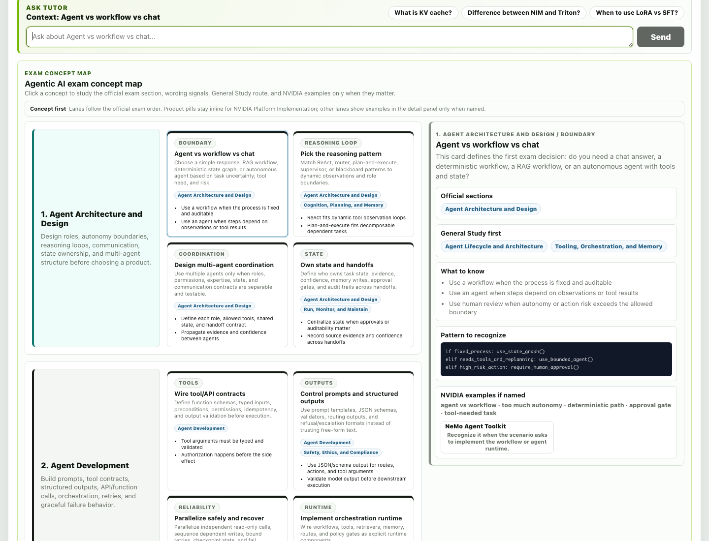
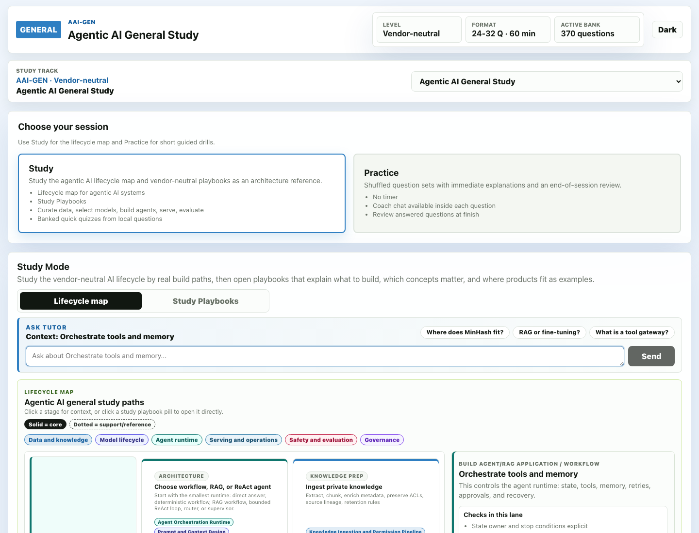

# NVIDIA Certification Practice

Local, research-backed React practice/test simulator for NVIDIA certifications. This revamp uses a separated Vite frontend and TypeScript backend while preserving the original local markdown/JSON data model.

This is a simulator, not an NVIDIA product. It uses original scenario-based practice questions calibrated to the public exam blueprint — no real exam content.

## Quick Start

```bash
cp .env.example .env       # then paste your LLM_API_KEY
npm install
npm run dev
```

Open http://localhost:5173 for Vite dev. The API runs at http://localhost:4273.

The practice bank and generated mock questions load without an LLM key. Coach chat, per-question hints, adaptive coach selection, and AI question generation show a setup message until `LLM_API_KEY` is configured in `.env` and the dev server is restarted.

## Screenshots

Captured from the local app in Google Chrome.



The Agentic AI exam concept map links official sections, General Study prerequisites, and NVIDIA examples only where product wording matters.



Clicking a General Study chip switches into the matching vendor-neutral lifecycle section and selects the relevant study card.

## Modes

- **Practice** — no timer, immediate feedback after each answer (right/wrong + explanation + why-wrong notes).
- **Test** — timed, deferred grading like the real Certiverse-proctored exam.

Both modes have **Adaptive** (weak-domain biased) and **Full-Bank** variants.

## Study Strategy

Use the app in this order when preparing for NCP-AAI or NCP-GENL:

1. Read **General Study** first for reusable concepts such as ReAct, RAG, KV cache, p95/p99 latency, LoRA/QLoRA, routing, monitoring, and guardrails.
2. Read the selected certificate's **Exam Concept Map** and **Exam Sections** to map those concepts to the official NVIDIA blueprint.
3. Open NVIDIA service pages only when the exam wording names a product, platform, hardware family, or deployment stack.
4. Use downloaded/original mocks as warmup and pattern exposure. They are useful, but the local audit marks them as easier, shorter, and less scenario-heavy than the generated readiness mocks.
5. Use generated balanced mocks as the stronger readiness check: they are 60-question sets aligned to official domain weights and capped by general-concept vs NVIDIA-specific scope.

Passing only third-party/original mocks is not treated as enough evidence here. A better readiness signal is high scores on both original mocks and generated balanced mocks, plus the ability to explain why the wrong answers solve the wrong layer.

## Question Bank

Edit active question-bank shards under `certifications/<cert_slug>/mocks/original/*.questions.md` or `certifications/<cert_slug>/generated/high_fidelity_###.md`. Each question:

```markdown
### Q21: A 70B chat model must serve ≥3,000 concurrent requests on H100s while staying within 1 ROUGE-L point of FP16. Best quantization recipe?
- ID: opt-021
- Domain: Model Optimization
- A. ...
- B. ...
- C. ...
- D. ...
- Answer: B
- Explanation: ...
- Why A is wrong: ...
```

Parsed at runtime by `server/src/domain/simulator.ts`.

To reshuffle a bank file safely, including question order, answer-choice order, `Answer:` labels, and `Why X is wrong` labels:

```bash
npm run shuffle:bank -- certifications/<cert_slug>/generated/high_fidelity_001.md --in-place
```

The same script can shuffle mock JSON `questionIds`:

```bash
npm run shuffle:bank -- certifications/<cert_slug>/mocks/original/mock_1.json --in-place
```

Runtime practice/test sessions also shuffle loaded questions and choices in the UI while preserving the original answer mapping for grading.

## Generate New Questions

After adding `LLM_API_KEY` to `.env` and restarting:
- Click **Generate 10 (weak domains)** on the dashboard, or
- `POST /api/generate-questions` with `{count, weakOnly, focusDomains}`

Output is appended to `certifications/<slug>/generated/drafts.md` for manual review. Approval state is stored in `certifications/<slug>/generated/approvals.json`.

By default, the server sends an OpenAI-style chat-completions request to the Kimi endpoint configured in `.env.example`. Override `LLM_API_URL` and `LLM_MODEL` for another compatible provider.

## Layout

```
certifications/<slug>/
├── blueprint.json          # official weights + format
├── mocks/
│   ├── original/           # original mock JSON + normalized question text
│   └── generated/          # generated mock JSON playlists
├── generated/
│   ├── high_fidelity_001.md
│   ├── high_fidelity_002.md
│   ├── drafts.md           # AI-generated review queue
│   └── approvals.json      # approved/rejected draft IDs
├── mistakes.md             # auto-appended on wrong answers
├── learner_profile.md      # auto-updated per session
├── reference/              # PDF, research report, notes
└── archive/                # superseded banks
```

## Run

```bash
npm run dev        # Vite client + API server
npm run build      # build client into client/dist
npm start          # build + serve built app from http://localhost:4273
npm test           # Vitest domain tests against the active TypeScript backend
npm run typecheck  # TypeScript verification
```

## Multi-Cert

Add a new cert by creating `certifications/<new-slug>/` with a `blueprint.json`, `mocks/original/*.questions.md`, and/or `generated/high_fidelity_###.md`. Set `CERT_SLUG` in `.env` or pass `?cert=<slug>` to API endpoints.

## Files of Note

- `client/src/app/App.jsx` — React UI migrated to Vite
- `client/src/styles/app.css` — preserved visual baseline
- `server/src/index.ts` — API server and static built-client server
- `server/src/domain/simulator.ts` — markdown parsing + grading
- `server/src/domain/learnerProfile.ts` — profile merge logic
- `server/src/domain/questionGenerator.ts` — LLM question generation and tutor flows
- `shared/src/types.ts` — shared payload/domain types
- `ARCHITECTURE.md` — full system reference
